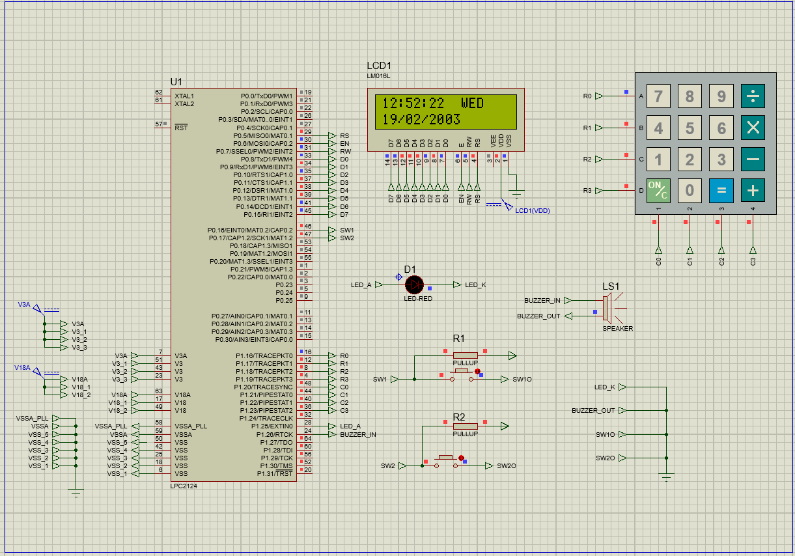
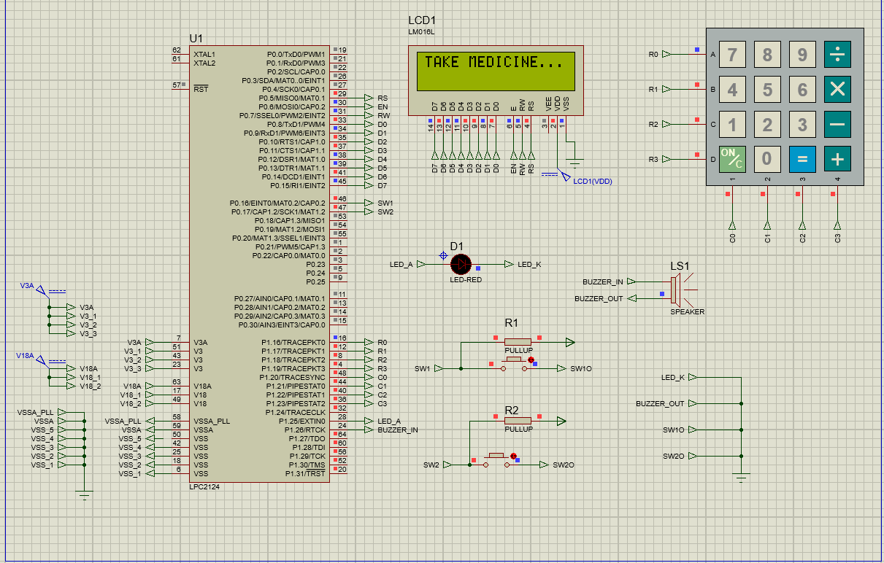

# 📦 DoseGuardian — Intelligent Pill-Taking Assistant

**DoseGuardian** is an embedded systems-based intelligent medication reminder designed to ensure timely medicine intake and improve patient health management.  
Built on an ARM7 microcontroller (LPC21xx), this system integrates a real-time clock, LCD display, keypad interface, LED indicators, and buzzer alerts for accurate medicine scheduling and user interaction.

---

## 🎯 Project Objective

The objective of **DoseGuardian – Intelligent Pill-Taking Assistant** is to design and develop a real-time embedded system that ensures timely medication intake through automated scheduling and alert mechanisms.

This project aims to:

- Develop a reliable **real-time medicine reminder system** using an ARM7 microcontroller.
- Implement accurate time tracking using an integrated **Real-Time Clock (RTC)** module.
- Design a user-friendly interface using a **16×2 LCD display and 4×4 matrix keypad**.
- Trigger visual and audio alerts (buzzer) when scheduled medicine time is reached.
- Detect and indicate missed doses to improve medication adherence.
- Demonstrate modular and structured **Embedded C firmware development**.

The system focuses on improving healthcare compliance while showcasing practical embedded systems design and hardware-software integration skills.

---

## ⚙️ Working Principle

## 1️⃣ Setting the Medicine Schedule 

- User presses Switch1

- Enters medicine time via keypad

- Schedule is stored in microcontroller memory

- LCD displays stored schedule along with RTC info

## 2️⃣ Real-Time Monitoring

- Microcontroller continuously checks RTC time

- Compares current time with stored medicine schedule

## 3️⃣ Alert Mechanism

- When time matches: LCD displays: “Take Medicine Now”

- Buzzer toggles ON/OFF at specific intervals

## 4️⃣ User Acknowledgment

- User presses Switch2

- If acknowledged → system resets and continues monitoring

- If NOT acknowledged within defined time → Red LED turns ON (Missed Dose)

---

## 📦 Hardware Components Used

| Component | Role |
|-----------|------|
| **LPC2148 ARM7 Microcontroller** | Main processing unit |
| **16×2 LCD Display (LM016L)** | Visual interface |
| **4×4 Matrix Keypad** | Input device |
| **Real-Time Clock (RTC)** | Timekeeping |
| **Buzzer** | Audio alert |
| **LED Indicator** | Visual alert |
| **Pull-up Resistors & Power Supply** | Circuit support | 

---

## 💻 Software & Tools

- Embedded C  
- Keil µVision IDE  
- Flash Magic  
- Proteus (Simulation)  
- ARM7 LPC21xx Libraries  

---

## 📸 Simulation Results (Proteus Verification)

The complete system was designed and validated using **Proteus Design Suite** to ensure correct functionality before hardware deployment.  
The simulation verifies RTC timing accuracy, user input handling, and medicine alert triggering.

### 🖥️ 1️⃣ System Initialization & RTC Display
The system initializes the Real-Time Clock and continuously displays the current time on the 16×2 LCD.

**Verified:**
- RTC time increment accuracy  
- LCD data communication  
- Proper initialization sequence  

---

### 💊 2️⃣ Medicine Time Configuration
Users can configure medicine reminder timings using the 4×4 matrix keypad interface.

**Verified:**
- Keypad scanning logic  
- Time input validation  
- LCD menu navigation  

---

### 🔔 3️⃣ Medicine Alert Trigger
When the RTC time matches the scheduled medicine time:
- Buzzer activates  
- LED indicator blinks  
- LCD displays reminder notification  

**Verified:**
- Time comparison algorithm  
- Alert triggering mechanism  
- User confirmation workflow  

---

### ⚙️ 4️⃣ Complete Circuit Simulation
Full Proteus schematic showing microcontroller, LCD, keypad, RTC module, buzzer, and LED connections.

**Verified:**
- Pin configuration correctness  
- Peripheral interfacing  
- System-level integration  

---

### ✅ Simulation Outcome

✔ Accurate RTC synchronization  
✔ Reliable user input handling  
✔ Real-time medicine alert generation  
✔ Successful system-level validation before hardware implementation  

---

## 🧪 How It Works (User Flow)

1. **Power On & Initialize**  
   System initializes RTC and LCD.

2. **Set Current Time**  
   Navigate using keypad to update the RTC time.

3. **Configure Medicine Time**  
   Enter medicine reminders (hours/minutes).

4. **Reminder & Alerts**  
   When the current time matches the medicine time:  
   - Buzzer sounds   
   - LCD displays alert 

5. **User Confirmation**  
   User confirms intake using the switch-2.

---

## 📈 Benefits & Impact

- Helps elderly and memory-challenged individuals follow medication schedules
- Improves treatment outcomes
- Reduces dependency on caregivers for medicine reminders
- Demonstrates practical embedded system design skills

---

## 🚀 Applications

- Elderly Patient Care
- Hospital Monitoring Systems
- Smart Home Healthcare
- Personal Medicine Reminder Device

---

## 🎯 Future Improvements

- GSM Notification System
- IoT Integration
- Mobile App Synchronization
- Multiple Medicine Scheduling
- EEPROM Storage

---

## 💡 Credits

*Developed by:* **Korada Praveen Kumar**  
Electronics and Communication Engineer 📡  

---

## 📄 License

This project is developed for **educational and demonstration purposes**.

---
